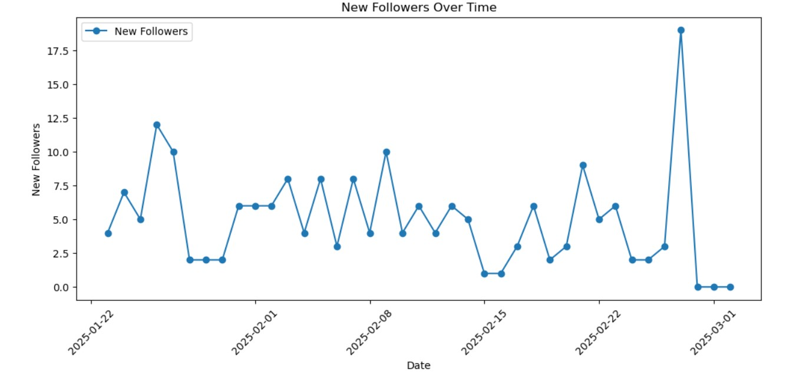
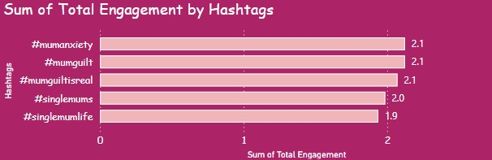

  

# 🌟 Social Media Analytics — Instagram & Facebook Performance Insights  
### 👩‍💻 Project by **Yuvashri Rajendran**

A complete analytics project exploring content performance across Instagram & Facebook.  
Using **Python, Excel & Power BI**, this study identifies engagement behavior, hashtag effectiveness, follower trends, and platform-level interaction patterns.

---

## 🎯 Objective

✔ Identify what content performs best  
✔ Compare engagement across platforms  
✔ Analyse hashtag reach & impact  
✔ Measure audience demographics & growth  
✔ Convert insights into actionable strategy  

> 💡 Data-driven insights that improve engagement, reach & visibility.

---

## 🛠 Tools & Tech Used

| Category | Technologies |
|---|---|
| Analysis | Python, Pandas, NumPy, Excel |
| Visualisation | Power BI Dashboard |
| Reporting | PDF + DOCX Project Report |
| Platforms | Instagram & Facebook |
| Metrics | ERR, ERI, Engagement %, Impressions |

---

## 🔥 Key Insights

📍 **Instagram**
- Primary audience → **35–44 years**
- Growth observed → **+194 new followers**
- Peak Engagement Rate (**ERR**) → **10.67%**
- Top-performing content → emotional & parent-support posts
- Strongest hashtags → `#singlemums`, `#mumguilt`, `#singlemomlife`

📍 **Facebook**
- Engagement fluctuates: **12.9 to 2500**
- Visual story-style posts received highest reaction

> 📌 Combine **high-reach + high-engagement hashtags** for best results.

---

## 📸 Visual Outputs

| Engagement Trend | Follower Growth | Hashtag Performance |
|---|---|---|
|  |  |  |

Additional insight visual → `Total_engagement_by_Platform.jpg`

---

## 💡 Recommendations

| Strategy | Outcome |
|---|---|
| Reels + Carousels over static posts | More reach & impression depth |
| Targeted hashtag clusters (5–15) | Better discoverability |
| Best post time → evenings/weekends | Higher response probability |
| A/B test captions & thumbnails | Increased conversions |
| Location-based content | Audience segmentation growth |

---

## 🔮 Future Enhancements

☑ Follower growth forecasting (Time-Series)  
☑ Comment sentiment classification (NLP)  
☑ Post-timing heatmap generation  
☑ ML-powered hashtag suggestion system  

---

⭐ If this project helped you — **Leave a Star!** ⭐  

